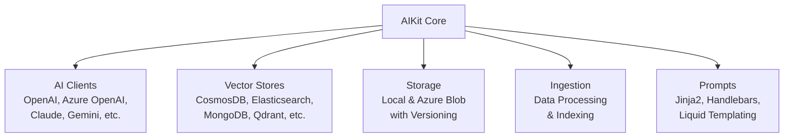

# AIKit

AIKit is a comprehensive .NET library designed to simplify integrations with various AI services, vector databases, and storage solutions. Built for .NET 10, it provides a unified API for interacting with popular AI providers and managing data efficiently.

## Features

- **AI Clients**: Support for multiple AI providers including OpenAI, Azure OpenAI, Claude, Azure Claude, Gemini, Mistral, Groq, Bedrock, Ollama, and GitHub Models.

  ```mermaid
  flowchart TD
      A[Configure AIClientSettings] --> B[Create Provider e.g., ChatClientProvider]
      B --> C["Get Client via provider.Create()"]
      C --> D[Use Client for AI Interactions]
  ```

- **Vector Stores**: Integrations with vector databases like CosmosDB, Elasticsearch, MongoDB, PgVector, Qdrant, Redis, SqlServer, SqliteVec, Weaviate, and Azure AI Search.

  ```mermaid
  flowchart TD
      A[Choose Vector Store e.g., InMemoryVectorStore] --> B[Add Documents with Vectors]
      B --> C[Search for Similar Vectors]
      C --> D[Retrieve Results]
  ```

- **Storage**: Local and Azure Blob storage providers with versioning support.

  ```mermaid
  flowchart TD
      A[Select Storage Provider e.g., LocalVersionedStorageProvider] --> B[Save Files with Options]
      B --> C[Read or List Versions]
      C --> D[Manage File Versions]
  ```

- **Ingestion**: Core ingestion pipeline for processing and indexing data.

  ```mermaid
  flowchart TD
      A[Input Data] --> B[Process via Ingestion Pipeline]
      B --> C[Index into Vector Store]
      C --> D[Ready for Search]
  ```

- **Prompts**: Templating support with Jinja2, Handlebars, and Liquid.

  ```mermaid
  flowchart TD
      A[Define Template e.g., Jinja2] --> B[Render with Data]
      B --> C[Use in AI Prompts]
  ```

- **Extensible**: Easy to add new providers and customize behavior.

## Installation

Install AIKit via NuGet:

```bash
dotnet add package AIKit.Core
```

For specific components:

```bash
dotnet add package AIKit.Clients.OpenAI
dotnet add package AIKit.VectorStores.CosmosDB
# etc.
```

## Quick Start

### Using an AI Client

```csharp
using AIKit.Core.Clients;
using AIKit.Clients.OpenAI;

// Configure settings
var settings = new AIClientSettings
{
    ApiKey = "your-api-key",
    Endpoint = "https://api.openai.com/v1",
    ModelId = "gpt-4"
};

// Create provider
var provider = new ChatClientProvider(settings);

// Get client
var client = provider.Create();

// Use client
var response = await client.GetResponseAsync("Hello, world!");
```

### Using a Vector Store

```csharp
using AIKit.Core.VectorStores;

// Configure and use a vector store
var store = new InMemoryVectorStore(); // or other implementations
await store.AddAsync(new VectorDocument { Id = "1", Vector = new float[] { 0.1f, 0.2f } });
var results = await store.SearchAsync(new float[] { 0.1f, 0.2f }, 5);
```

## Architecture



- **Core**: Shared interfaces and base classes.
- **Clients**: AI provider implementations.
- **VectorStores**: Vector database integrations.
- **Storage**: Data storage abstractions.
- **Ingestion**: Data processing pipelines.
- **Prompts**: Templating engines.

## Contributing

Contributions are welcome! Please see [CONTRIBUTING.md](CONTRIBUTING.md) for guidelines.

## License

This project is licensed under the MIT License - see the [LICENSE](LICENSE) file for details.

## Support

For issues or questions, please open an issue on GitHub.