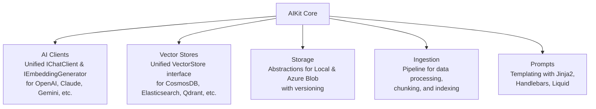

# AIKit

[](https://github.com/durmisi/AIKit/actions)
[](https://opensource.org/licenses/MIT)
[](https://dotnet.microsoft.com/)

AIKit is a comprehensive .NET library built for .NET 10 that simplifies integrating AI into your applications. Whether you're building chatbots, RAG (Retrieval-Augmented Generation) systems, or AI-powered tools, AIKit provides a unified API to interact with multiple AI providers, vector databases, storage solutions, and more—without vendor lock-in. Designed for .NET developers, it abstracts complexities so you can focus on your app's logic.

## Why AIKit?

As a .NET developer exploring AI integration, you might face challenges like switching between providers (e.g., OpenAI to Claude), managing vector embeddings for search, or processing large datasets. AIKit solves this with consistent interfaces, extensible builders, and built-in features like data ingestion pipelines and prompt templating. It's open-source, MIT-licensed, and leverages modern .NET patterns like dependency injection and async operations.

## Architecture

AIKit is modular, with core interfaces unifying diverse providers. Here's the high-level structure:



- **Core**: Shared interfaces (e.g., `IChatClient`, `VectorStore`) and builders for consistency.
- **Clients**: Provider-specific implementations (e.g., OpenAI, Azure OpenAI) using fluent builders.
- **VectorStores**: Integrations for vector databases, enabling efficient similarity search.
- **Storage**: File storage with versioning for managing datasets.
- **Ingestion**: Middleware-based pipelines for processing and indexing data into vector stores.
- **Prompts**: Templating engines to dynamically generate AI prompts.

This architecture lets you swap components (e.g., change AI providers) with minimal code changes.

## Packages Overview

AIKit is distributed as NuGet packages. Install only what you need for your project.

### AI Clients

Interact with AI providers for chat and embeddings.

| Package                     | Purpose                | Key Classes                                      |
| --------------------------- | ---------------------- | ------------------------------------------------ |
| `AIKit.Clients.OpenAI`      | OpenAI API integration | `ChatClientBuilder`, `EmbeddingGeneratorBuilder` |
| `AIKit.Clients.AzureOpenAI` | Azure OpenAI service   | `ChatClientBuilder`, `EmbeddingGeneratorBuilder` |
| `AIKit.Clients.Claude`      | Anthropic Claude       | `ChatClientBuilder`                              |
| `AIKit.Clients.AzureClaude` | Azure-hosted Claude    | `ChatClientBuilder`                              |
| `AIKit.Clients.Gemini`      | Google Gemini          | `ChatClientBuilder`, `EmbeddingGeneratorBuilder` |
| `AIKit.Clients.Mistral`     | Mistral AI             | `ChatClientBuilder`                              |
| `AIKit.Clients.Groq`        | Groq API               | `ChatClientBuilder`                              |
| `AIKit.Clients.Bedrock`     | AWS Bedrock            | `ChatClientBuilder`, `EmbeddingGeneratorBuilder` |
| `AIKit.Clients.Ollama`      | Local Ollama models    | `ChatClientBuilder`                              |
| `AIKit.Clients.GitHub`      | GitHub Models          | `ChatClientBuilder`, `EmbeddingGeneratorBuilder` |

### Vector Stores

Store and search vector embeddings for RAG and similarity search.

| Package                            | Purpose                       | Key Classes                |
| ---------------------------------- | ----------------------------- | -------------------------- |
| `AIKit.VectorStores.InMemory`      | In-memory storage for testing | `InMemoryVectorStore`      |
| `AIKit.VectorStores.CosmosMongoDB` | CosmosDB MongoDB API          | `CosmosMongoDBVectorStore` |
| `AIKit.VectorStores.CosmosNoSQL`   | CosmosDB NoSQL API            | `CosmosNoSQLVectorStore`   |
| `AIKit.VectorStores.Elasticsearch` | Elasticsearch                 | `ElasticsearchVectorStore` |
| `AIKit.VectorStores.MongoDB`       | MongoDB                       | `MongoDBVectorStore`       |
| `AIKit.VectorStores.PgVector`      | PostgreSQL with PgVector      | `PgVectorStore`            |
| `AIKit.VectorStores.Qdrant`        | Qdrant                        | `QdrantVectorStore`        |
| `AIKit.VectorStores.Redis`         | Redis                         | `RedisVectorStore`         |
| `AIKit.VectorStores.SqliteVec`     | SQLite with Vec extension     | `SqliteVecVectorStore`     |
| `AIKit.VectorStores.SqlServer`     | SQL Server                    | `SqlServerVectorStore`     |
| `AIKit.VectorStores.Weaviate`      | Weaviate                      | `WeaviateVectorStore`      |
| `AIKit.VectorStores.AzureAISearch` | Azure AI Search               | `AzureAISearchVectorStore` |

### Data Ingestion

| Package                          | Purpose                                                                                                                                          | Key Classes                                       |
| -------------------------------- | ------------------------------------------------------------------------------------------------------------------------------------------------ | ------------------------------------------------- |
| `AIKit.DataIngestion`            | Data ingestion pipelines                                                                                                                         | `IngestionPipelineBuilder<T>`, `ChunkingStrategy` |
| `AIKit.DataIngestion.Extensions` | Data ingestion extensions (built on [Microsoft.Extensions.DataIngestion](https://learn.microsoft.com/en-us/dotnet/ai/conceptual/data-ingestion)) | `SectionBasedChunkingStrategy`, `MarkdownReader`  |

### Prompts

| Package                    | Purpose               | Key Classes                |
| -------------------------- | --------------------- | -------------------------- |
| `AIKit.Prompts.Jinja2`     | Jinja2 templating     | `Jinja2PromptExecutor`     |
| `AIKit.Prompts.Handlebars` | Handlebars templating | `HandlebarsPromptExecutor` |
| `AIKit.Prompts.Liquid`     | Liquid templating     | `LiquidPromptExecutor`     |

### Storage

| Package               | Purpose              | Key Classes                     |
| --------------------- | -------------------- | ------------------------------- |
| `AIKit.Storage`       | Storage abstractions | `IStorageProvider`              |
| `AIKit.Storage.Azure` | Azure Blob storage   | `AzureBlobStorageProvider`      |
| `AIKit.Storage.Local` | Local file storage   | `LocalVersionedStorageProvider` |

## Quick Start

### 1. Install Packages

Add the core package and any specific ones you need:

```bash
dotnet add package AIKit.Clients.OpenAI
dotnet add package AIKit.VectorStores.InMemory
```

### 2. Configure an AI Client

Use builders for easy setup:

```csharp
using AIKit.Clients.OpenAI;

// Create a chat client
var chatClient = new ChatClientBuilder()
    .WithApiKey("your-openai-api-key")
    .WithModel("gpt-4")
    .Build();

// Get a response
var response = await chatClient.GetResponseAsync("Explain AIKit in simple terms.");
Console.WriteLine(response.Text);
```

### 3. Store and Search Vectors

For embeddings and search:

```csharp
using AIKit.VectorStores.InMemory;
using Microsoft.Extensions.VectorData; // For VectorDocument

// Create a vector store
var vectorStore = new InMemoryVectorStore();

// Add a document with embedding
await vectorStore.AddAsync(new VectorDocument
{
    Id = "doc1",
    Vector = new ReadOnlyMemory<float>(new float[] { 0.1f, 0.2f, 0.3f }),
    Metadata = new Dictionary<string, object> { ["title"] = "AIKit Intro" }
});

// Search for similar vectors
var results = await vectorStore.SearchAsync(
    new ReadOnlyMemory<float>(new float[] { 0.1f, 0.2f, 0.3f }),
    new VectorSearchOptions { Top = 5 });

foreach (var result in results)
{
    Console.WriteLine($"Found: {result.Record.Id}");
}
```

## Usage Examples

### Building a Simple RAG System

Combine clients, ingestion, and vector stores:

```csharp
using AIKit.Clients.GitHub;
using AIKit.DataIngestion;
using AIKit.DataIngestion.Services.Chunking;
using Microsoft.Extensions.AI;
using Microsoft.ML.Tokenizers;
using System.Text;

public class VectorRecord
{
    [Microsoft.Extensions.VectorData.VectorStoreKey]
    public required string Key { get; set; }

    [Microsoft.Extensions.VectorData.VectorStoreVector(1536)]
    public ReadOnlyMemory<float> Vector { get; set; }

    public required Dictionary<string, object?> Metadata { get; set; }
}

// 1. Set up AI client
var chatClient = new AIKit.Clients.GitHub.ChatClientBuilder()
    .WithGitHubToken("your-github-token")
    .WithModel("gpt-4o-mini")
    .Build();

// 2. Set up embedding generator
var embeddingGenerator = new EmbeddingGeneratorBuilder()
    .WithGitHubToken("your-github-token")
    .WithModel("text-embedding-3-small")
    .Build();

// 3. Create vector store
var builder = new AIKit.VectorStores.InMemory.VectorStoreBuilder();
var vectorStore = builder.Build();
var collection = vectorStore.GetCollection<string, VectorRecord>("My-vectors");
await collection.EnsureCollectionExistsAsync();

// 4. Build ingestion pipeline
var tokenizer = TiktokenTokenizer.CreateForModel("gpt-4");
var chunkingStrategy = new SectionBasedChunkingStrategy(tokenizer, new ChunkingOptions
{
    MaxTokensPerChunk = 100,
    OverlapTokens = 10
});

var pipeline = new IngestionPipelineBuilder<DataIngestionContext>()
    .Use(next => async (ctx, ct) =>
    {
        var content = """
# AIKit Overview

AIKit is a comprehensive .NET library built for .NET 10 that simplifies integrating AI into your applications.
""";
        using var stream = new MemoryStream(Encoding.UTF8.GetBytes(content));
        var document = await new MarkdownReader().ReadAsync(stream, "document.md", "text/markdown");
        ctx.Documents.Add(document);
        await next(ctx, ct);
    })
    .Use(next => async (ctx, ct) =>
    {
        foreach (var document in ctx.Documents)
        {
            var chunks = await chunkingStrategy.Chunk(document);
            ctx.DocumentChunks[document.Identifier] = chunks;
        }
        await next(ctx, ct);
    })
    .Use(next => async (ctx, ct) =>
    {
        foreach (var kvp in ctx.DocumentChunks)
        {
            var documentId = kvp.Key;
            var chunks = kvp.Value;
            foreach (var chunk in chunks)
            {
                var embedding = await embeddingGenerator.GenerateAsync(chunk.Content);
                var record = new VectorRecord
                {
                    Key = Guid.NewGuid().ToString(),
                    Vector = embedding.Vector,
                    Metadata = new Dictionary<string, object?> { ["content"] = chunk.Content, ["documentId"] = documentId }
                };
                await collection.UpsertAsync(record);
            }
        }
        await next(ctx, ct);
    })
    .Build();

// 5. Ingest data
await pipeline.ExecuteAsync(new DataIngestionContext());

// 6. Query with RAG
var queryEmbedding = await embeddingGenerator.GenerateAsync("What is AIKit?");
var contextBuilder = new StringBuilder();
await foreach (var r in collection.SearchAsync(queryEmbedding.Vector, top: 3))
{
    var content = r.Record.Metadata["content"]?.ToString();
    contextBuilder.AppendLine(content);
}
var context = contextBuilder.ToString().Trim();
var prompt = $"Context: {context}\nQuestion: What is AIKit?";
var answer = await chatClient.GetResponseAsync(prompt);
Console.WriteLine(answer.Text);
```


### Using Prompt Templating

Render dynamic prompts:

```csharp
using AIKit.Prompts.Jinja2;

var template = "Hello {{name}}, explain {{topic}}.";
var executor = new Jinja2PromptExecutor(chatClient);
var renderedPrompt = executor.Render(template, new { name = "Developer", topic = "AI integration" });
var response = await executor.ExecuteAsync(renderedPrompt);
```

### Custom Providers

Extend for new AI services by implementing `IChatClient` or using builders.

## Benefits

- **Unified API**: Switch providers (e.g., OpenAI to Claude) by changing configuration, not code.
- **Extensibility**: Add custom providers or middleware easily.
- **Performance**: Async-first, with built-in retry and logging.
- **Ecosystem Integration**: Works with .NET's dependency injection and Microsoft.Extensions.AI.
- **Cost-Effective**: Open-source, no vendor fees beyond provider APIs.
- **Community-Driven**: Contribute or fork for your needs.

## Contributing

We welcome contributions! Fork the repo, make changes, and submit a PR. See [CONTRIBUTING.md](CONTRIBUTING.md) for details.

## License

MIT License. See [LICENSE](LICENSE) for details.

## Support

Have questions? Open an issue on GitHub or check the docs.
